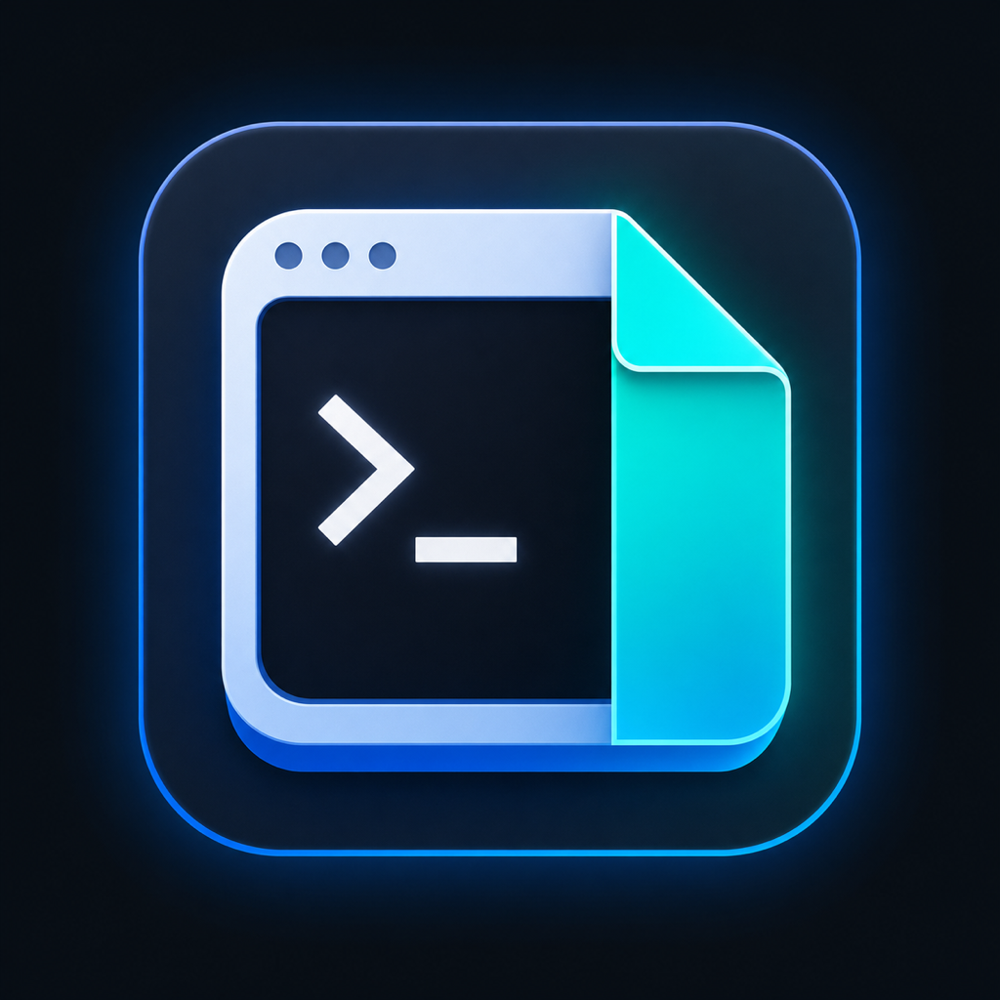
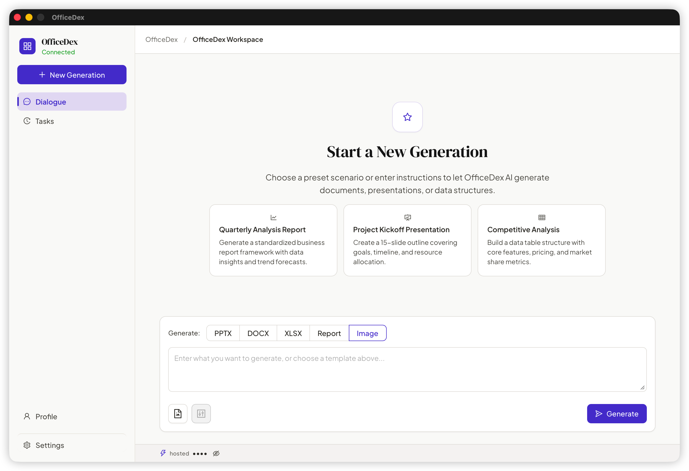
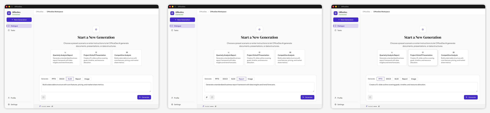
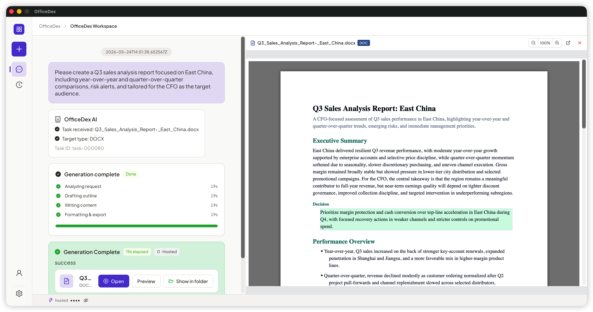
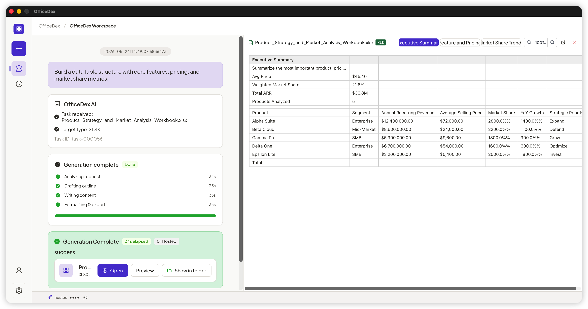
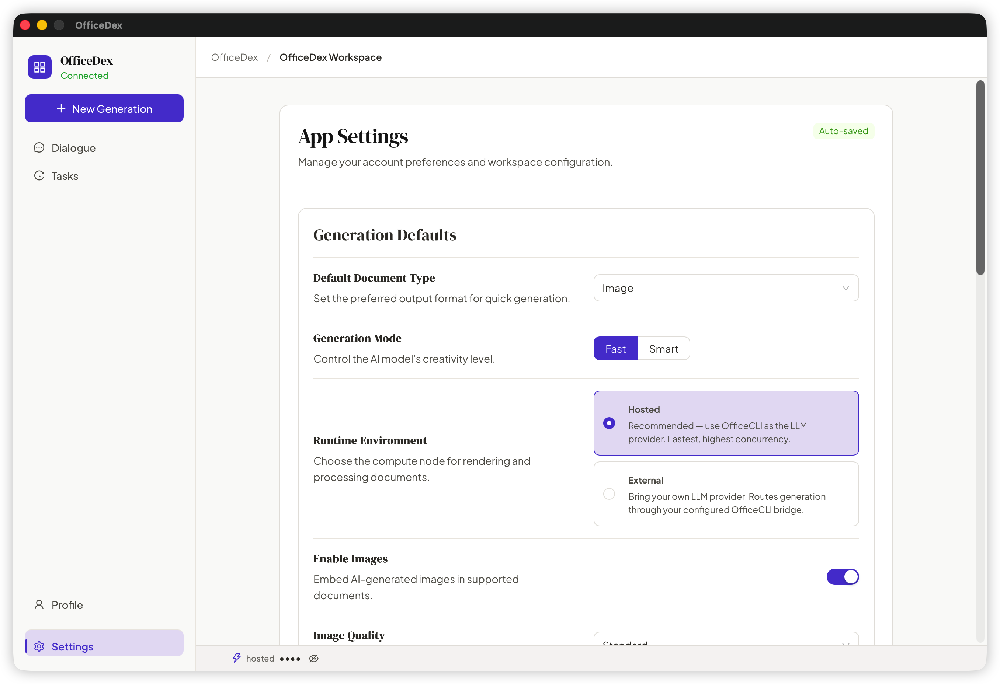

<div align="center">



# OfficeDex

### The AI desktop workspace for documents, slides, and spreadsheets

**Chat to generate · Runs locally · Notion-styled · Truly cross-platform native**



<p>
  
  <a href="docs/README.zh-CN.md"></a>
</p>

<p>
  <a href="https://github.com/officecli/officedex/releases/latest"></a>
  <a href="#-core-capabilities"></a>
  
</p>

<sub>OfficeDex is the official desktop client for OfficeCLI — wrapping its command-line generation engine in a fluent, WYSIWYG conversational workspace.</sub>

<br/>

<p>
  
  
  
  
  
</p>

<p>
  <a href="https://officecli.io"></a>
  <a href="https://github.com/officecli/officecli"></a>
  <a href="https://discord.gg/ezAHMkdG"></a>
  <a href="https://x.com/officecli"></a>
</p>

</div>

---

## ⚡ OfficeDex in 30 Seconds

<table>
<tr>
<td width="50%">

**Input**

> "Write a Q3 sales analysis report focused on the East China region, include YoY and QoQ charts, target audience is the CFO."

</td>
<td width="50%">

**Output**

📄 `Q3-East-China-Sales.docx` (12 pages)
📊 4 data charts + 3 trend analyses
⏱ Typical generation: 45–90s
👁 One-click inline preview — no need to open Word

</td>
</tr>
</table>

<div align="center">


<sub>↑ From one sentence to a finished Word doc in under a minute.</sub>

</div>

---

## 📑 Table of Contents

<table>
<tr>
<td>

- [⚡ 30-Second Overview](#-officedex-in-30-seconds)
- [🎯 What is OfficeDex](#-what-is-officedex)
- [🔥 Why OfficeDex](#-why-officedex)

</td>
<td>

- [✨ Core Capabilities](#-core-capabilities)
- [🚀 Quick Start](#-quick-start)
- [📦 Build & Release](#-build--release)

</td>
<td>

- [🧩 Architecture](#-architecture)
- [🎨 Design Language](#-design-language)
- [🗺 Roadmap](#-roadmap)

</td>
<td>

- [❓ FAQ](#-faq)
- [📚 Documentation](#-documentation)
- [🤝 Feedback & Contributing](#-feedback--contributing)

</td>
</tr>
</table>

---

## 🎯 What is OfficeDex

In one sentence: **Tell it what you want — it generates Word / PPT / Excel for you.**

- 📝 **Natural language to documents** — Type "write a Q3 sales analysis report" and get structure, sections, illustrations, and charts automatically
- 🎨 **Slides in one shot** — Project kickoffs, product launches, industry briefings: built-in templates plus custom prompts
- 📊 **Spreadsheets & analysis** — Competitive matrices, financial models, survey results — Excel ready out of the box
- 🖼️ **Image input supported** — Paste screenshots or upload reference images; the AI understands visual context
- ⚙️ **Run locally or hosted** — Bring your own LLM (OpenAI / Claude / self-hosted) or use the OfficeCLI hosted runtime



---

## 🔥 Why OfficeDex

| Dimension | Web AI assistants | CLI tools | **OfficeDex** |
|---|:---:|:---:|:---:|
| 🖥 Native desktop feel | In-browser | Terminal | ✅ Wails native window |
| 📂 Local-first files | Manual download | ✅ Direct save | ✅ Direct save + one-click open |
| 👀 Inline preview | Open Office needed | None | ✅ DOCX/PPTX/XLSX rendered inline |
| 🔌 Custom LLM | Vendor-locked | ✅ Any | ✅ Any + GUI config |
| 🎨 UI & interaction | Generic | Plain text | ✅ Notion design system |
| 🔒 Data sovereignty | Cloud-first | ✅ Local | ✅ Local (hosted optional) |
| 💬 Mid-task interaction | Single-turn chat | None | ✅ AI asks back in real time, streaming status |

> In a phrase: **the feel of a desktop app × the power of the CLI × the taste of Notion.**

---

## ✨ Core Capabilities

### 1. Conversational generation — write docs like chatting

- Built-in scenarios (quarterly reports / kickoff slides / competitive analysis)
- Free-form prompts: control length, tone, target audience
- Continuous context: keep asking — "now add a page on risk assessment"

### 2. Live task stream — watch every step

- Streaming events → see what the AI is thinking and doing
- Mid-flight interaction: when the AI is unsure, it asks you to decide
- Cancel any time, restart any time

### 3. Inline preview — no need to open Office

<table>
<tr>
<td width="50%"></td>
<td width="50%"></td>
</tr>
<tr>
<td align="center"><sub>Word document</sub></td>
<td align="center"><sub>Spreadsheet</sub></td>
</tr>
</table>

Powered by `docx-preview` / `pdfjs-dist` / `xlsx` for inline rendering. DOCX / PPTX / XLSX / PDF all preview-able — **no Office install required**.

### 4. Configurable from Settings — no CLI required



- Custom LLM: OpenAI / Anthropic / Azure / self-hosted vLLM
- Custom OfficeCLI binary path (for developers)
- One-click runtime check & upgrade; works offline with a local binary

---

## 🚀 Quick Start

### Users: download the installer

| Platform | Installer | Notes |
|---|---|---|
| 🍎 macOS (Apple Silicon / Intel) | `OfficeDex-x.y.z-arm64.dmg` / `-x64.dmg` | Double-click `.dmg` → drag to Applications |
| 🪟 Windows 10/11 | `OfficeDex-Setup-x.y.z.exe` | Double-click to install. First launch auto-downloads the OfficeCLI runtime. |

Latest Release: **[github.com/officecli/officedex/releases/latest](https://github.com/officecli/officedex/releases/latest)**

> [!IMPORTANT]
> ### 🍎 macOS users — "OfficeDex.app" cannot be opened?
>
> Because the app is not yet Apple-notarized, Gatekeeper will block the first launch with a **"Apple could not verify..."** dialog.
>
> **Fix**: run the following command once in Terminal to strip the quarantine attribute, then you can double-click to open as usual:
>
> ```bash
> xattr -dr com.apple.quarantine /Applications/OfficeDex.app
> ```
>
> If the app lives elsewhere (e.g. `~/Downloads/OfficeDex.app`), substitute the actual path. This is a one-time operation and won't recur.

### Developers: run from source

```bash
# 1. Clone & install
git clone <your-repo-url>
cd officedex
npm install

# 2. Start dev mode (auto-prefetch OfficeCLI binary)
npm run dev

# 3. Type-check / unit tests / E2E
npm run lint
npx vitest run
npm run test:e2e
```

In dev mode, OfficeDex resolves the CLI in this order:

1. `OFFICECLI_DESKTOP_BINARY` env var
2. `officecli` on your `PATH`
3. Auto-download from GitHub Releases (default source: `officecli/officecli`)

---

## 📦 Build & Release

```bash
npm run dist:mac      # macOS (auto-codesigns bundled officecli)
npm run dist:win      # Windows
```

Build artifacts land in `build/bin/`. CI (`.github/workflows/release.yml`) produces `.dmg / .zip / .exe` and publishes a GitHub Release on every `v*` tag.

---

## 🧩 Architecture

```
┌───────────────────────────────────────────────────┐
│  OfficeDex (this repo)                            │
│  ┌──────────────────┐    ┌────────────────────┐   │
│  │  React 19 + Antd │ ←→ │  Wails Go runtime  │   │
│  │  Notion-styled   │    │  (main.go/app.go)  │   │
│  └──────────────────┘    └─────────┬──────────┘   │
└─────────────────────────────────────┼─────────────┘
                                      │ JSON-RPC stdio
                                      ▼
                          ┌────────────────────────┐
                          │  officecli agent-bridge│
                          │  (Go binary, sep. repo)│
                          └────────────────────────┘
```

- **Frontend**: React 19 + Ant Design 6 + custom Notion design tokens
- **Desktop shell**: Wails v2 (Go backend + system WebView frontend) — compact bundle size (build output < 30MB)
- **Generation engine**: decoupled `officecli` subprocess, communicating via JSON-RPC
- **Preview**: `docx-preview` / `pdfjs-dist` / `xlsx` inline rendering — no Office install required

---

## 🎨 Design Language

OfficeDex fully adopts the Notion design system:

- **Primary color** Notion Purple `#5645d4`
- **Typography** DM Serif Display (headings) + Plus Jakarta Sans (body)
- **Shape** 8px buttons / 12px cards / 9999px pills
- **Vibe** Warm neutrals, deep navy hero bands, pastel feature cards

Full spec: [`DESIGN.md`](DESIGN.md).

---

## 🛠 OfficeCLI Runtime Management

On first launch, OfficeDex pulls the matching `officecli` binary from GitHub Releases:

- Default source: `officecli/officecli` (override via `OFFICECLI_RELEASE_REPO`)
- Cache directory: `~/Library/Application Support/OfficeDex/runtime/` (macOS)
- Asset naming: `officecli-{darwin|win32|linux}-{arm64|x64}{.exe}`

From **Settings → OfficeCLI Runtime** you can: check for updates / switch versions / specify a local binary / revert to auto-downloaded.

---

## 🗺 Roadmap

What's on the way (in priority order):

| Status | Capability | Notes |
|:---:|---|---|
| ✅ Shipped | Document / PPT / Excel generation | Three core formats |
| ✅ Shipped | Inline preview panel | DOCX / PPTX / XLSX / PDF |
| ✅ Shipped | Image input (visual understanding) | Paste or upload reference images |
| ✅ Shipped | Notion-style UI | Customizable design tokens |
| 🚧 In progress | Multilingual UI (EN / 日本語) | Translation in preparation |
| 🚧 In progress | Template marketplace | Community-shared prompts and styles |
| 🔜 Planned | Collaborative mode | Multi-user editing on the same task |
| 🔜 Planned | Plugin system | Third-party generators |
| 🔜 Planned | Official Linux installers | AppImage / deb |
| 💭 Exploring | Mobile companion app | iOS / Android: view and trigger |

---

## ❓ FAQ

<details>
<summary><b>How does OfficeDex relate to OfficeCLI?</b></summary>

OfficeCLI is the underlying command-line tool (a separate Go repo) that handles actual document generation, LLM calls, and file output. OfficeDex is its desktop GUI shell: a React UI wrapped in Wails, talking to the `officecli agent-bridge` subprocess via JSON-RPC. They release in **lockstep**: OfficeDex auto-downloads and manages a matching OfficeCLI binary at startup.

</details>

<details>
<summary><b>Is my data uploaded to the cloud?</b></summary>

By default, fully local:

- Document generation runs on your machine
- LLM calls go directly to the provider you configured (OpenAI / Anthropic / self-hosted) — OfficeDex never proxies them
- Generated files are written to a local workspace (default: `~/Library/Application Support/OfficeDex/workspace`)

If you opt into "Hosted Runtime" (**Hosted Runtime** = OfficeCLI's official hosted proxy, so you don't have to configure your own LLM key), some calls route through the official proxy — the app displays a clear notice in that case.

</details>

<details>
<summary><b>Can I use my own OpenAI / Claude API key?</b></summary>

Yes. In **Settings → LLM Provider**, fill in `baseUrl` / `apiKey` / `model`. Supported:

- OpenAI official + compatible protocols (DeepSeek / Moonshot / self-hosted vLLM, etc.)
- Anthropic Claude
- Azure OpenAI

</details>

<details>
<summary><b>Which operating systems are supported?</b></summary>

- ✅ **macOS 12+** (Apple Silicon and Intel)
- ✅ **Windows 10 / 11** (x64)
- 🚧 **Linux** — binaries are built, but no official installer yet; run from source via `npm run dev`

</details>

<details>
<summary><b>Where are generated files stored?</b></summary>

Default workspace:

- macOS: `~/Library/Application Support/OfficeDex/workspace`
- Windows: `%APPDATA%/OfficeDex/workspace`

Change it via **Settings → Workspace**. After each generation, click "Show in Folder" to jump straight there.

</details>

<details>
<summary><b>Which document formats are supported?</b></summary>

| Input | Output | Preview |
|---|---|---|
| Natural-language prompt | `.docx` / `.pptx` / `.xlsx` / `.pdf` | ✅ All inline-previewable |
| Upload `.docx` / `.pdf` / `.md` as source material | Same | ✅ |
| Paste / upload images as reference | Same | ✅ |

</details>

<details>
<summary><b>Can I use it offline?</b></summary>

The desktop shell and preview panel are **fully offline**. Document generation needs an LLM, so:

- Cloud APIs: requires internet
- Local models (Ollama / vLLM / LM Studio): fully offline — point `baseUrl` at e.g. `http://localhost:11434/v1`

The OfficeCLI runtime also supports a manually specified local path — no downloads required.

</details>

<details>
<summary><b>How do I report a bug?</b></summary>

In the app, click **"Report Issue"** in the top-right corner. It automatically collects:

- App version + platform info
- Recent OfficeCLI logs (sanitized)
- Current task state snapshot

Copy the generated markdown and paste it into a GitHub Issue.

</details>

---

## 📚 Documentation

- [`DESIGN.md`](DESIGN.md) — Full design spec
- [`CLAUDE.md`](CLAUDE.md) — Project conventions & collaboration guidelines
- [`docs/README.zh-CN.md`](docs/README.zh-CN.md) — 简体中文版

---

## 🤝 Feedback & Contributing

- 🐛 Bugs / suggestions: click "Report Issue" in-app — diagnostics are bundled automatically
- 💬 Discussion: PRs and issues welcome
- ⭐ Like it? A star is the best encouragement for the team

<div align="center">

<sub>Made with 💜 by the OfficeDex team · Runs natively on macOS / Windows</sub>

</div>
