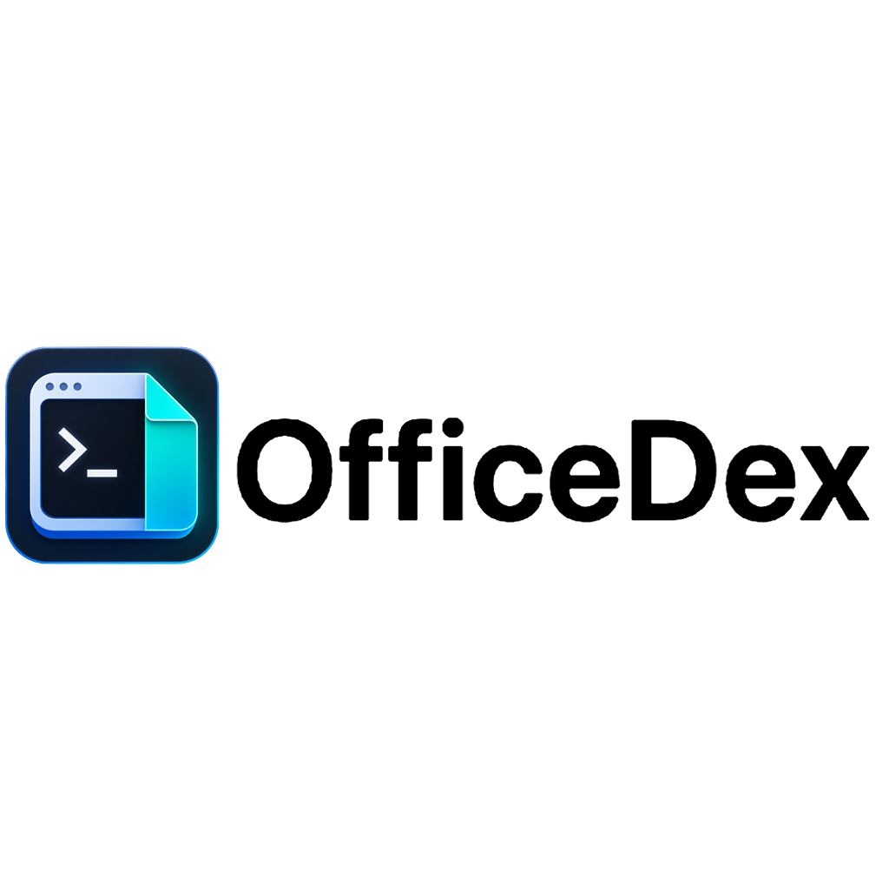
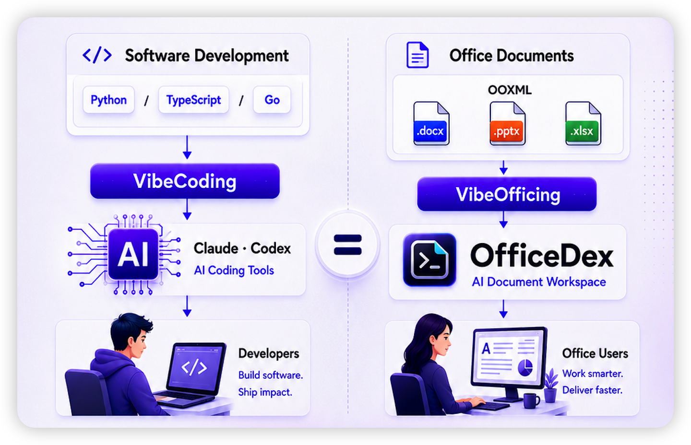
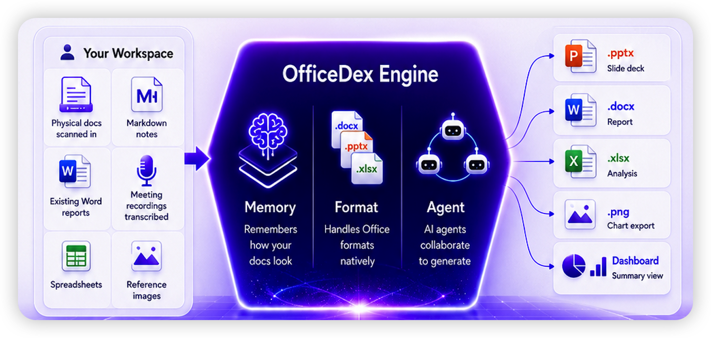

<div align="center">



### AI-Native VibeOfficing 平台

**VibeCoding 写代码，VibeOfficing 写文档。OfficeDex 让它发生。**


<p>
  <a href="../README.md"></a>
  
</p>

<p>
  <a href="https://github.com/officecli/officedex/releases/latest"></a>
  <a href="#-核心能力"></a>
  
</p>

<sub>OfficeDex 是 OfficeCLI 的官方桌面客户端 — AI-Native VibeOfficing 平台，用自然语言生成 Word、PPT、Excel 和图片，全程本地运行。</sub>

<br/>

<p>
  
  
  
  
  
</p>

<p>
  <a href="https://officecli.io"></a>
  <a href="https://github.com/officecli/officecli"></a>
  <a href="https://discord.gg/ezAHMkdG"></a>
  <a href="https://x.com/officecli"></a>
</p>

</div>

---

## 💡 VibeOfficing

程序员已经在 **VibeCoding** — 描述意图，AI 写程序。
**VibeOfficing** 是同一范式在文档领域的映射。

> 说出你要什么 → OfficeDex 直接产出原生 `.docx` / `.pptx` / `.xlsx`。

- **理解 OOXML** 格式、模板和排版惯例 — 就像编码 AI 理解编程语言、框架和设计模式
- **没有中间产物。** 不用复制粘贴，不用手动排版。
- 输出的**就是**最终文件。



| 编程世界 | 办公世界 | AI 需要理解的 |
|---|---|---|
| 编程语言（Python / Go / TS） | 文档格式（OOXML：.docx / .pptx / .xlsx） | **底层语法** |
| 框架（React / Django / Spring） | 文档模板（季报模板、路演 PPT、竞品分析表） | **结构范式** |
| 设计模式（MVC / Observer） | 排版习惯（标题层级、配色方案、图表风格） | **风格惯例** |

### Memory · Format · Agent

OfficeDex 不只是"一句话 → 一个文件"，而是一个**带记忆的文档工作台**。

- **Memory** — 跨会话记住你的风格和设计语言。第 50 份报告自动延续第 1 份的品质。
- **Format** — 原生处理 OOXML，不走 HTML 渲染，不靠导出碰运气。
- **Agent** — 多个 AI 智能体协作：一个规划结构，一个撰写内容，一个处理排版。

> **OfficeDex 不只记住你说了什么，还记住你的文档长什么样。** 把你的风格数字化到 OfficeDex — 再也不用从零开始。



---

## ⚡ 30 秒看懂 OfficeDex

<table>
<tr>
<td width="50%">

**输入**

> "做一份 Q3 销售分析报告，重点放在华东区，包含同比环比图表，目标读者是 CFO。"

</td>
<td width="50%">

**输出**

📄 `Q3-华东销售分析.docx` (12 页)
📊 内含 4 张数据图 + 3 张趋势分析
⏱ 平均生成 45-90 秒
👁 一键内置预览，不用开 Word

</td>
</tr>
</table>

<div align="center">


<sub>↑ 从一句话到一份完整 Word，全程不到 1 分钟</sub>

</div>

---

## 📑 目录

<table>
<tr>
<td>

- [⚡ 30 秒看懂](#-30-秒看懂-officedex)
- [🎯 OfficeDex 是什么](#-officedex-是什么)
- [💡 VibeOfficing](#-vibeofficing)
- [🔥 为什么选 OfficeDex](#-为什么选-officedex)

</td>
<td>

- [✨ 核心能力](#-核心能力)
- [🚀 快速开始](#-快速开始)
- [📦 打包发布](#-打包发布)

</td>
<td>

- [🧩 架构一瞥](#-架构一瞥)
- [🎨 设计语言](#-设计语言)
- [🗺 路线图](#-路线图)

</td>
<td>

- [❓ 常见问题](#-常见问题)
- [📚 相关文档](#-相关文档)
- [🤝 反馈与贡献](#-反馈与贡献)

</td>
</tr>
</table>

---

## 🎯 OfficeDex 是什么

一句话：**告诉它你要什么，它生成 Word / PPT / Excel 给你。**

- 📝 **自然语言到文档** — 输入"做一份 Q3 销售分析报告"，自动生成结构、章节、配图、数据图表
- 🎨 **演示文稿一键成型** — 项目启动、产品发布、行业洞察，预设模板 + 自定义指令
- 📊 **数据表与分析** — 竞品对比、财务模型、调研问卷，自动产出 Excel
- 🖼️ **图片输入支持** — 粘贴截图 / 上传参考图，AI 理解视觉上下文
- ⚙️ **本地或托管运行** — 既能跑你自己的 LLM（OpenAI / Claude / 自托管），也能用 OfficeCLI 托管运行时


---

## 🔥 为什么选 OfficeDex

| 维度 | 网页版 AI 助手 | 命令行工具 | **OfficeDex** |
|---|:---:|:---:|:---:|
| 🖥 桌面原生体验 | 浏览器内 | 终端 | ✅ Wails 原生窗口 |
| 📂 文件本地化 | 需手动下载 | ✅ 直接落盘 | ✅ 直接落盘 + 一键打开 |
| 👀 内置预览 | 需打开 Office | 无 | ✅ DOCX/PPTX/XLSX 内联渲染 |
| 🔌 自定义 LLM | 依赖供应商生态 | ✅ 任意 | ✅ 任意 + 图形化配置 |
| 🎨 视觉与人机交互 | 通用样式 | 纯文本 | ✅ Notion 设计系统 |
| 🔒 数据可控 | 云端为主 | ✅ 本地 | ✅ 本地（可选托管） |
| 💬 中途交互 | 单轮聊天 | 无 | ✅ AI 实时提问、流式状态 |

> 一句话：**停止手动排版，开始 VibeOfficing。**

---

## ✨ 核心能力

### 1. 对话式生成 — 像聊天一样写文档

- 内置常用场景（季度报告 / 启动 PPT / 竞品分析）
- 自由 prompt：支持指定篇幅、风格、目标读者
- 上下文连续：完成后可继续追问"再加一页风险评估"

### 2. 实时任务流 — 看得见每一步

- 流式事件 → 看到 AI 的思考与执行
- 中途交互：AI 不确定时主动询问，你来拍板
- 一键取消、随时重启

### 3. 内置预览 — 不用打开 Office 就能看

<table>
<tr>
<td width="50%"></td>
<td width="50%"></td>
</tr>
<tr>
<td align="center"><sub>Word 文档</sub></td>
<td align="center"><sub>数据表</sub></td>
</tr>
</table>

基于 `docx-preview` / `pdfjs-dist` / `xlsx` 内联渲染，DOCX / PPTX / XLSX / PDF 全部支持预览，**无需安装 Office**。

### 4. 设置即可改 — 不必碰命令行


- 自定义 LLM：OpenAI / Anthropic / Azure / 自部署 vLLM
- 自定义 OfficeCLI 二进制路径（开发者向）
- 一键检测/升级 runtime，离线也可指定本地 binary

---

## 🚀 快速开始

### 用户：直接下载安装包

| 平台 | 安装包 | 备注 |
|---|---|---|
| 🍎 macOS (Apple Silicon / Intel) | `OfficeDex-x.y.z-arm64.dmg` / `-x64.dmg` | 双击 .dmg → 拖入 Applications |
| 🪟 Windows 10/11 | `OfficeDex-Setup-x.y.z.exe` | 双击安装，首次启动自动下载 OfficeCLI runtime |

最新 Release：**[github.com/officecli/officedex/releases/latest](https://github.com/officecli/officedex/releases/latest)**

> [!IMPORTANT]
> ### 🍎 macOS 用户必读 — 提示 "OfficeDex.app" Not Opened？
>
> 因为 app 尚未做 Apple 公证（notarization），首次打开时 Gatekeeper 会弹窗拦截，提示 **"Apple could not verify..."**。
>
> **解决方法**：在终端运行一次以下命令，去掉隔离属性后即可正常双击打开：
>
> ```bash
> xattr -dr com.apple.quarantine /Applications/OfficeDex.app
> ```
>
> 如果你把 app 放在了别处（比如 `~/Downloads/OfficeDex.app`），把路径替换成实际位置即可。这是一次性操作，不会重复出现。

### 开发者：本地跑起来

```bash
# 1. 克隆并安装
git clone <your-repo-url>
cd officedex
npm install

# 2. 启动开发模式（自动 prefetch OfficeCLI 二进制）
npm run dev

# 3. 类型检查 / 单测 / E2E
npm run lint
npx vitest run
npm run test:e2e
```

开发环境下，OfficeDex 按以下顺序解析 CLI：

1. 环境变量 `OFFICECLI_DESKTOP_BINARY`
2. `PATH` 上的 `officecli`
3. 自动从 GitHub Releases 下载（默认源 `officecli/officecli`）

---

## 📦 打包发布

```bash
npm run dist:mac      # macOS（自动 codesign 内置 officecli）
npm run dist:win      # Windows
```

构建产物默认输出到 `build/bin/`，CI 通过 `.github/workflows/release.yml` 自动产出 `.dmg / .zip / .exe` 并发布到 GitHub Releases（推 `v*` tag 触发）。

---

## 🧩 架构一瞥

```
┌───────────────────────────────────────────────────┐
│  OfficeDex (this repo)                            │
│  ┌──────────────────┐    ┌────────────────────┐   │
│  │  React 19 + Antd │ ←→ │  Wails Go runtime  │   │
│  │  Notion 风格 UI   │    │  (main.go/app.go)  │   │
│  └──────────────────┘    └─────────┬──────────┘   │
└─────────────────────────────────────┼─────────────┘
                                      │ JSON-RPC stdio
                                      ▼
                          ┌────────────────────────┐
                          │  officecli agent-bridge│
                          │  (Go binary, 独立仓库)  │
                          └────────────────────────┘
```

- **前端**：React 19 + Ant Design 6 + 自研 Notion-style 设计令牌
- **桌面壳**：Wails v2 (Go 后端 + 系统 WebView 前端) — 安装包体积小（参考构建产物 < 30MB）
- **生成引擎**：解耦的 `officecli` 子进程，通过 JSON-RPC 通信
- **预览**：`docx-preview` / `pdfjs-dist` / `xlsx` 内联渲染，无需安装 Office

---

## 🎨 设计语言

OfficeDex 全量采用 Notion 设计系统：

- **主色** Notion Purple `#5645d4`
- **字体** DM Serif Display (标题) + Plus Jakarta Sans (正文)
- **形状** 按钮 8px / 卡片 12px / Pill 9999px
- **氛围** 暖中性色调，深 navy hero 带 + pastel 功能卡

完整规范见 [`../DESIGN.md`](../DESIGN.md)。

---

## 🛠 OfficeCLI Runtime 管理

OfficeDex 首次启动会自动从 GitHub Releases 拉取匹配平台的 `officecli` 二进制：

- 默认源：`officecli/officecli`（可通过 `OFFICECLI_RELEASE_REPO` 改写）
- 缓存目录：`~/Library/Application Support/OfficeDex/runtime/` (macOS)
- 资产命名：`officecli-{darwin|win32|linux}-{arm64|x64}{.exe}`

在 **设置 → OfficeCLI Runtime** 面板可以：检查更新 / 切换版本 / 指定本地 binary / 回滚到自动版本。

---

## 🗺 路线图

正在路上的能力（按优先级排序）：

| 状态 | 能力 | 备注 |
|:---:|---|---|
| ✅ 已上线 | 文档 / PPT / Excel 生成 | 三种核心格式 |
| ✅ 已上线 | 内置预览面板 | DOCX / PPTX / XLSX / PDF |
| ✅ 已上线 | 图片输入（视觉理解） | 粘贴或上传参考图 |
| ✅ 已上线 | Notion 风格 UI | 设计令牌可定制 |
| 🚧 进行中 | 多语言界面（EN / 日本語） | 翻译资源准备中 |
| 🚧 进行中 | 模板市场 | 用户共享 prompt 与样式 |
| 🔜 计划中 | 协作模式 | 多人编辑同一份生成任务 |
| 🔜 计划中 | 插件系统 | 第三方扩展生成器 |
| 🔜 计划中 | Linux 官方安装包 | AppImage / deb |
| 💭 在调研 | 移动端伴侣 App | iOS / Android 查看与触发 |

---

## ❓ 常见问题

<details>
<summary><b>OfficeDex 和 OfficeCLI 是什么关系？</b></summary>

OfficeCLI 是底层的命令行工具（独立仓库，Go 写的），负责真正的文档生成、LLM 调用、文件输出。OfficeDex 是它的桌面 GUI 外壳：用 Wails 包了一层 React 界面，通过 JSON-RPC 跟 `officecli agent-bridge` 子进程通信。两者**绑定发布**：OfficeDex 启动时会自动下载/管理匹配版本的 OfficeCLI 二进制。

</details>

<details>
<summary><b>数据会上传到云端吗？</b></summary>

默认完全本地：

- 文档生成在你的机器上完成
- LLM 调用直连你配置的 provider（OpenAI / Anthropic / 自部署），OfficeDex 不做中转
- 生成的文件写到本地工作区（默认 `~/Library/Application Support/OfficeDex/workspace`）

如果你选用了"托管运行时"（**Hosted Runtime** = OfficeCLI 官方托管的代理服务，免去自己配置 LLM Key），则部分调用会经过官方代理，应用内会有明确提示。

</details>

<details>
<summary><b>我能用自己的 OpenAI / Claude API Key 吗？</b></summary>

可以。**设置 → LLM Provider** 里填入 `baseUrl` / `apiKey` / `model` 即可。支持：

- OpenAI 官方 + 兼容协议（DeepSeek / Moonshot / 自部署 vLLM 等）
- Anthropic Claude
- Azure OpenAI

</details>

<details>
<summary><b>支持哪些操作系统？</b></summary>

- ✅ **macOS 12+**（Apple Silicon 和 Intel）
- ✅ **Windows 10 / 11**（x64）
- 🚧 **Linux** — 二进制已构建但暂未官方分发，可自行从源码 `npm run dev` 运行

</details>

<details>
<summary><b>生成的文件存在哪里？</b></summary>

默认工作区：

- macOS: `~/Library/Application Support/OfficeDex/workspace`
- Windows: `%APPDATA%/OfficeDex/workspace`

可在 **设置 → 工作区** 改成任意目录。每次生成完成可点「在文件夹中显示」直接定位。

</details>

<details>
<summary><b>支持哪些文档格式？</b></summary>

| 输入 | 输出 | 预览 |
|---|---|---|
| 自然语言 prompt | `.docx` / `.pptx` / `.xlsx` / `.pdf` | ✅ 全部内联预览 |
| 上传 `.docx` / `.pdf` / `.md` 作为来源 | 同上 | ✅ |
| 粘贴/上传图片作为参考 | 同上 | ✅ |

</details>

<details>
<summary><b>能离线使用吗？</b></summary>

桌面壳和预览面板**完全离线**。但是文档生成需要 LLM，所以：

- 用云端 API：要联网
- 用本地模型（Ollama / vLLM / LM Studio）：可完全离线，把 baseUrl 指向 `http://localhost:11434/v1` 之类即可

OfficeCLI runtime 也支持手动指定本地路径，无需联网下载。

</details>

<details>
<summary><b>遇到 bug 怎么报告？</b></summary>

应用内右上角点 **「报告问题」**，会自动收集：

- 应用版本 + 平台信息
- 最近的 OfficeCLI 日志（脱敏）
- 当前任务状态快照

复制生成的 markdown，粘贴到 GitHub Issue 即可。

</details>

---

## 📚 相关文档

- [`../DESIGN.md`](../DESIGN.md) — 完整设计规范
- [`../CLAUDE.md`](../CLAUDE.md) — 项目约定 & 协作准则

---

## 🤝 反馈与贡献

- 🐛 Bug / 建议：应用内点击右上角「报告问题」会自动收集诊断信息
- 💬 讨论：欢迎 PR / Issue
- ⭐ 觉得好用？给个 Star 是对作者最大的鼓励

<div align="center">

<sub>Made with 💜 by the OfficeDex team · 在 macOS / Windows 上原生跑得很顺</sub>

</div>
