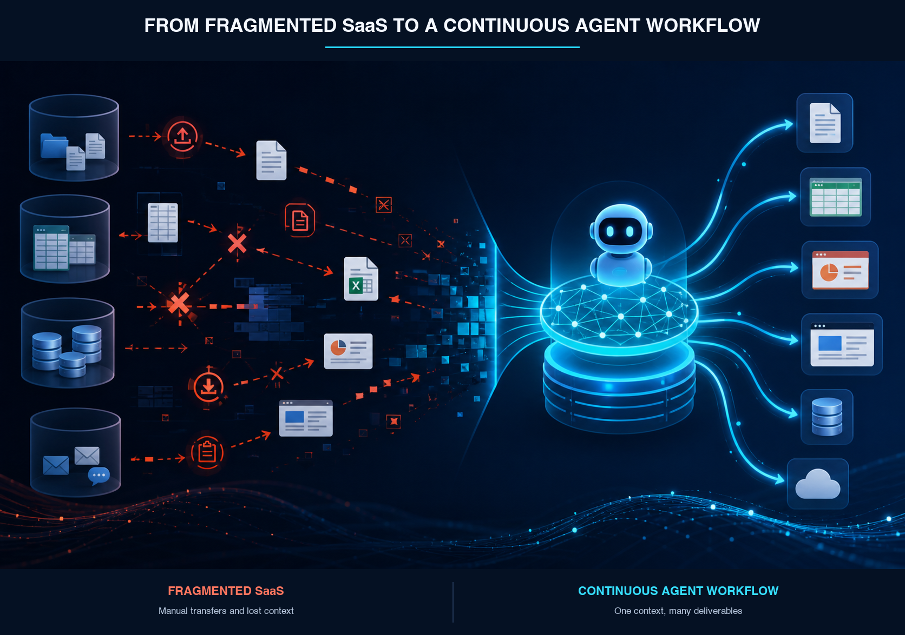
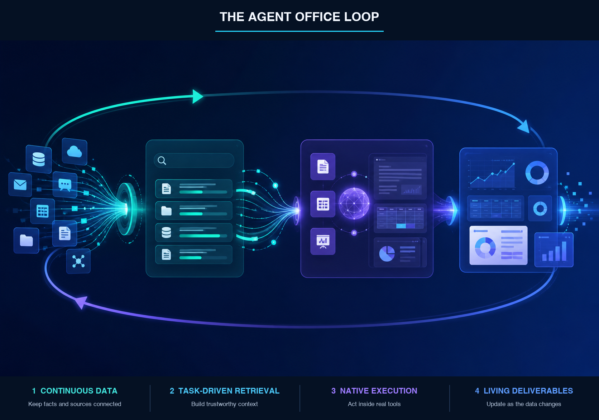
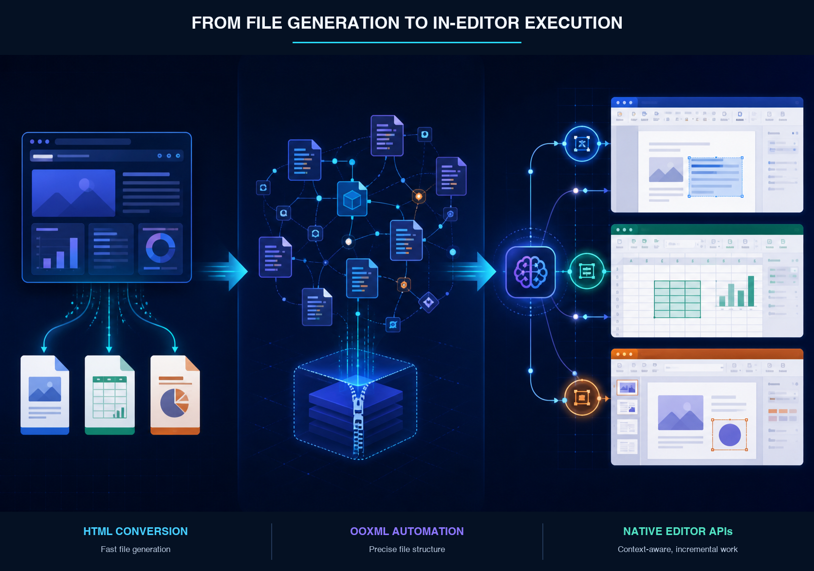
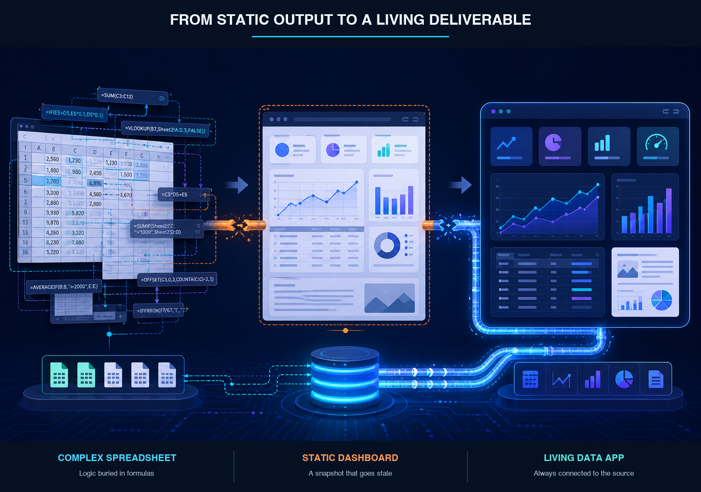

# Stop Calling It AI Office. The Next Generation Is Agent Office

When people talk about AI in office software, they still tend to picture the same set of features: a writing assistant in a document, a formula assistant in a spreadsheet, or a tool that turns an outline into slides.

All of those features are useful. But they leave the basic structure of office work untouched. Files are still the center of gravity. Applications still define the boundaries. And the user is still responsible for moving information between tools, stitching the workflow together, and keeping the final result current.

Agents point to a more fundamental change.

An agent does more than generate. It can understand an objective, break it into steps, find relevant knowledge, operate tools, recover from errors, and deliver a result. It can also return to that result when the underlying data changes.

Once AI starts taking responsibility for that full chain of work, *AI Office* is no longer a particularly useful name for the category. A better term is **Agent Office**.

Agent Office does not simply mean office software with an agent bolted on. It means an office environment organized around tasks, with the agent acting as the primary executor. The person supplies the goal, constraints, standards, and scope of authority. The agent gathers context, plans the work, uses the appropriate tools, and delivers the outcome as a document, spreadsheet, presentation, webpage, video, audio file, or some combination of them.

The distinction is straightforward:

> AI Office means there is AI inside the software. Agent Office means work is carried out by an agent.

Traditional office software is built around files. SaaS is built around applications. Agent Office is built around tasks.

That shift—from files to tasks—changes almost everything about how office software should be designed.

## The problem with SaaS: agents inherit all of our data silos

SaaS made software easier to deploy and collaboration easier to manage. It also scattered company data across a growing collection of products, modules, workspaces, and account systems.

A single organization may use separate tools for documents, spreadsheets, project management, CRM, knowledge bases, cloud storage, email, meetings, and analytics. Even when several of those tools come from the same vendor, they often rely on different data structures and permission models underneath.

People have learned to work around this fragmentation. Agents have a harder time doing so reliably.

### Every handoff is another chance to lose meaning

A moderately complex piece of work often looks like this:

- Search for material in one system.
- Export data to Excel or CSV.
- Upload it to another tool for analysis.
- Copy the findings into a document.
- Turn the document into a presentation.
- Publish or send the result through email, cloud storage, or a content platform.

The workflow is full of I/O: uploads, downloads, imports, exports, copying, pasting, and format conversion. We have come to accept these actions as part of using software. For an agent, however, every transfer adds cost, ambiguity, and another point of failure.

A CSV export can lose formulas, field types, and relationships. Copying a document into a presentation can flatten its hierarchy. Images, footnotes, citations, and provenance can disappear along the way.

An agent does not merely need access to a collection of files. It needs to understand how the information inside those files is related, and it needs to preserve those relationships while moving between different forms of work.

*Figure 1. Fragmented SaaS workflows versus a continuous agent workflow.*

### Fast search and good research are not the same thing

Most SaaS products were designed for deterministic operations with low latency. Search is a good example. Traditional systems use keyword matching, inverted indexes, tokenization, tags, and ranking rules so that results appear almost instantly.

That works well when the query is precise. It works less well when the question is closer to: “Why did customer churn rise in East China last year?”

A conventional search engine may match terms such as *East China*, *customer*, *churn*, and *reason*. It can return documents containing those words in milliseconds. But that is not the same as answering the question.

An agent has to do more. It needs to work out what the user is actually trying to learn, decide which data is relevant, search across multiple sources, remove duplicates, compare conflicting evidence, perform calculations, and produce a conclusion that still points back to its sources.

That may involve several rounds of retrieval using BM25, metadata filters, vector search, and reranking. It may take longer than a familiar search box. The important metric is no longer “How quickly did we return ten links?” It is “Did we find enough reliable evidence to complete the task?”

Retrieval is not the end of an agent's job. It is one step in a larger piece of work.

## Why the agent matters

Many current office AI products still mirror the boundaries of traditional software. Document AI writes prose. Spreadsheet AI creates formulas and analyzes tables. Presentation AI produces slides.

That model is easy to understand, but it starts from the application rather than the user's actual goal.

A user rarely wakes up wanting “a spreadsheet.” They may want to understand how China's population structure has changed over the past thirty years and prepare material that can be used for analysis, a management briefing, and public communication. The spreadsheet, report, presentation, and video are simply different instruments used along the way.

This is what separates an agent from an assistant. An assistant waits for a prompt and returns an answer or a piece of content. An agent keeps working toward an objective. It decides what information it needs next, which tool to use, how to check the result, and when human approval is required.

For an office product to deserve the name Agent Office, it should have at least four properties:

- **Goal-driven:** It accepts responsibility for completing a piece of work, not merely generating a fragment of content.
- **Able to plan:** It can split the objective into research, analysis, production, verification, and publishing steps, then adjust the plan as new information appears.
- **Able to act:** It can operate search, databases, documents, spreadsheets, presentations, websites, and business systems instead of stopping at advice in a chat window.
- **Stateful and accountable:** It preserves task context, sources, execution history, and the relationships between deliverables. It knows when to ask for approval and what needs to change when the source data changes.

“Agent” is not another name for a chatbot. It describes a new role in software: an actor that can understand, act, observe the result, correct its course, and continue until the work is ready to deliver.

In office work, that role comes down to three broad capabilities.

### Processing data

Agents can turn unstructured material into structured data, and structured data back into conclusions people can use.

They can read webpages, PDFs, images, meeting notes, databases, and spreadsheets, then extract, clean, classify, deduplicate, calculate, verify, and summarize what they find. Processes that once required people to move repeatedly between tools can become one coordinated workflow.

### Connecting data

The value of data often comes from the relationship between sources rather than any one source on its own.

Sales figures describe an outcome. Connect them with marketing spend, product releases, customer feedback, and regional economic data, and they may begin to explain that outcome. An agent can bring those sources into a common analytical frame for the task at hand.

### Changing the form of an idea

The same body of evidence can become a table, report, chart, slide deck, webpage, podcast, or video. Today, people usually create each version separately. An agent can preserve the facts and reasoning while adapting the form to a different audience.

One research project might produce:

- a three-page decision brief for executives;
- a full report for the operating team;
- a presentation for an all-hands meeting;
- a script for a short video;
- an article for a public audience; and
- a structured dataset for further analysis.

Files do not disappear in this model. They stop being isolated units of work. They become different views of the same task.

## The architecture of Agent Office

If the task is the fundamental unit, an office product can no longer be organized solely around three entrances labeled Document, Spreadsheet, and Presentation.

It needs a closed loop: acquire data and knowledge, build the right context, execute through real tools, and produce deliverables that remain connected to their sources.

I think of that loop as four interdependent layers: **data continuity, task-driven retrieval, native execution, and living deliverables**.

Without continuous data, retrieval sees fragments. Without reliable retrieval, generated work lacks evidence. Without native execution, the agent remains stuck outside the editing environment, converting files back and forth. And without living deliverables, the finished task collapses back into a set of static files that someone has to maintain by hand.

*Figure 2. The four layers of the Agent Office loop.*

### 1. Data continuity: understand a fact once

Turning a spreadsheet into a report and then turning that report into a presentation often means copying and reinterpreting the same information several times. At every boundary, field definitions, measurement rules, source links, and version history can be lost.

Agent Office first needs to keep data continuous throughout the task.

Suppose someone asks for an analysis of thirty years of demographic change in China. The agent may collect public data, clean and verify it, and create a structured dataset. That same dataset should drive the analysis table, research report, presentation, and video script. The number of tools involved is less important than the fact that every deliverable uses the same definitions, evidence, and calculations.

When a new year of data is released, the system should know which charts, paragraphs, and slides are affected. The user should not have to rebuild the entire chain.

This requires paragraphs, tables, charts, and slides to retain their provenance and transformation history. Files still matter, but they are no longer the place where relationships end.

### 2. Task-driven retrieval: new work begins with existing knowledge

Real office work rarely begins from a blank page. A new document or presentation usually builds on previous files, current data, meeting decisions, company templates, and feedback from colleagues.

Before generating anything, an agent has to find the right material.

Consider an annual strategy presentation. The agent may need to inspect earlier strategy decks, operating reviews, budget spreadsheets, meeting notes, brand templates, and executive comments. It has to decide which claims are still valid, which numbers need to be refreshed, and which ideas were superseded by later decisions. It also has to understand versions, dates, authorship, projects, and citations before reorganizing the material for a new audience.

The hard part of generating a good presentation is not producing twenty attractive slides from one sentence. It is finding complete and current evidence, then constructing the right story without losing the trail back to the source.

This is where local agent retrieval can be especially valuable. It can run repeated searches across files the user has authorized, combining lexical search, metadata, semantic retrieval, and reranking. It may be slower than conventional SaaS search. Its job is also harder: build trustworthy working context, not a list of links.

### 3. Native execution: move the agent inside the editor

Once the agent has the right data and context, it still needs to operate office software.

AI-generated office files have broadly followed three technical paths: HTML conversion, direct OOXML manipulation, and editor APIs. These are not merely three implementation choices. They represent three different relationships between the agent and the office environment.

HTML conversion is a quick way to produce a file. It is relatively easy to build, but browser layout does not map cleanly to pagination, slide masters, themes, formulas, comments, and native object models. The resulting file may look acceptable while remaining awkward to edit.

Direct OOXML manipulation offers much finer control. An agent can edit paragraphs, cells, slides, styles, charts, and resource relationships. But it also has to manage complex XML structures and compatibility rules. The agent is closer to the native file, yet it is still working largely outside the editor.

Editor APIs create a different relationship. The agent can enter the environment the user is already working in. It can understand the selection, document structure, spreadsheet region, filter state, slide master, and page objects. It can make local, incremental, and reversible changes.

Instead of regenerating an entire presentation, it might update only the slides that cite an old number. When new rows appear in a spreadsheet, it might refresh the affected chart without replacing the workbook.

Few platforms offer reasonably systematic extension APIs across documents, spreadsheets, and presentations. Microsoft Office, WPS Office, and Shimo Docs are notable examples, although their API coverage, permissions, runtime models, and openness differ considerably by product and version.

The next competition in office software will therefore involve more than model quality. It will also be a competition between object models and execution interfaces.

If an agent can only import and export files, it remains outside the office environment. To become a genuine participant in the work, it needs to read context, observe changes, perform scoped writes, and take part in preview, undo, approval, and audit workflows.

*Figure 3. From generating files outside the editor to executing work inside it.*

### 4. Living deliverables: the result should not freeze in time

Traditional spreadsheets bury a surprising amount of business logic in formulas, cell references, pivot tables, and chart configuration. AI can make it easier to write a formula, but that does not make the formula easier for everyone else to inspect or maintain.

AI-generated HTML dashboards improve the reading experience. They can replace a dense grid with cards, charts, rankings, and filters. But if the data is embedded in the page, the dashboard is still only a snapshot. As soon as the source table changes, it becomes stale.

The next step is a lightweight data application that remains connected to its source.

Vite or another frontend tool can be part of the implementation, but the important idea is not the build tool. It is the separation between the data source and the presentation logic. The page continues to read from a spreadsheet, database, API, or observable data file, then recalculates and renders against a stable structure.

This fits the way many business tables actually evolve. The schema—date, region, product, customer, amount—usually changes slowly. New records arrive every day. An agent can define the metrics, chart logic, and layout once, while new data continues to flow through the same application.

The user does not need to understand formulas or frontend code. They can ask for a region filter, switch revenue to gross margin, or add a year-over-year view in plain language.

Once the dashboard remains connected to its source, it can also influence other deliverables. When an anomaly appears, the agent can locate the underlying records, revise the explanation in a weekly report, and flag the presentation slides that now need an update.

At that point, the table, dashboard, report, and presentation are no longer static files generated in sequence. They are related views of one continuing task.

*Figure 4. From complex spreadsheets and static dashboards to a living, data-connected application.*

## Think in task loops, not application suites

These four layers lead to a product that is quite different from a bundle of document AI, spreadsheet AI, and presentation AI.

After the user sets an objective, the system establishes the task boundary and delivery requirements. It collects information from the web, local files, and authorized business systems. It builds context through task-driven retrieval. It then uses documents, spreadsheets, presentations, webpages, and media tools to do the work. Finally, it preserves the sources, calculations, versions, and references that make the result reviewable and maintainable.

Documents, spreadsheets, and presentations remain important. But they become task views rather than starting points. A spreadsheet shows the data. A document shows the argument. A presentation shows the narrative. A live webpage shows the current indicators. All four can share the same underlying facts instead of maintaining the appearance of consistency through copy and paste.

This also changes the human side of the interface. Traditional software asks users to understand menus, formulas, formatting rules, and file conversion. Agent Office asks them to define objectives, constraints, standards, and authority.

The agent handles more of the intermediate work, but the person should still approve consequential conclusions, external publication, sensitive writes, and high-risk actions. Autonomy is useful only when it comes with legible boundaries and accountability.

An Agent Office therefore cannot be identified by the presence of a chat panel or an “AI Generate” button. It has to succeed at four things: finding the right material, keeping data consistent, acting reliably in real tools, and maintaining the result after delivery.

Miss any one of those, and the product tends to fall back into being a more convenient content generator.

## Three tests for the shift from AI Office to Agent Office

There are three useful tests for whether a product has made the transition.

The first is whether it is centered on files or tasks. File-centered AI answers questions such as “How should I write this document?” or “What formula belongs in this cell?” Task-centered AI asks what data, tools, decisions, and deliverables are required to reach the objective.

The second is whether it produces a one-off result or maintains an ongoing relationship. A generated report, webpage, or deck begins aging the moment it is created. Agent Office should know which data supports each conclusion, which deliverables use that conclusion, and what needs to change when the data moves.

The third is whether it generates files outside the software or keeps working inside the software. Moving from file production to shared maintenance requires a capable object model, events, permissions, scoped operations, and auditability.

All three tests reflect the same underlying change. Office is becoming less of a file-production toolkit and more of a runtime for knowledge work. The agent is becoming the execution layer that connects data, knowledge, tools, and results.

## Why the next generation is Agent Office

Traditional Office helped people make files. SaaS helped teams collaborate online. The first generation of AI Office helped people generate content faster. Agent Office should help them complete the work.

It cannot be confined to a single application, file format, or generation button. Its real challenge is to keep information continuous across systems and forms, give agents enough context and authority to act, and make every result verifiable, reusable, and capable of staying current.

When someone asks, “How has China's population changed over the past thirty years?”, an Agent Office should do more than write a paragraph or create a table. It should be able to gather sources, clean and verify the data, perform the analysis, prepare the report and presentation, adapt the work for other formats, and update the affected outputs when new data arrives.

The files still exist. They simply stop being isolated endpoints. They become the data view, analytical view, narrative view, and communication view of the same task.

That is why *Agent Office* is the more useful name for what comes next. The defining question is no longer whether the software contains AI. It is whether an agent can connect data, knowledge, and tools—and take accountable responsibility for a piece of work from objective to outcome.

**Traditional Office edits files. AI Office generates content. Agent Office completes the work—and keeps it current.**

---

## About OfficeDex

[OfficeDex](https://officedex.ai) is our attempt to build toward this model: a workspace where agents can work across documents, spreadsheets, presentations, research, and generated applications while keeping the task—not the file format—at the center.

*This essay is adapted from the original Chinese article published on WeChat.*
